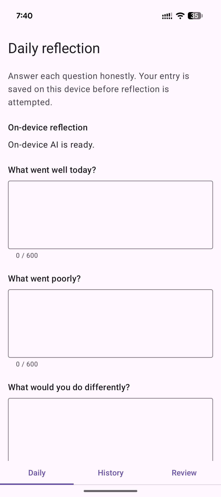
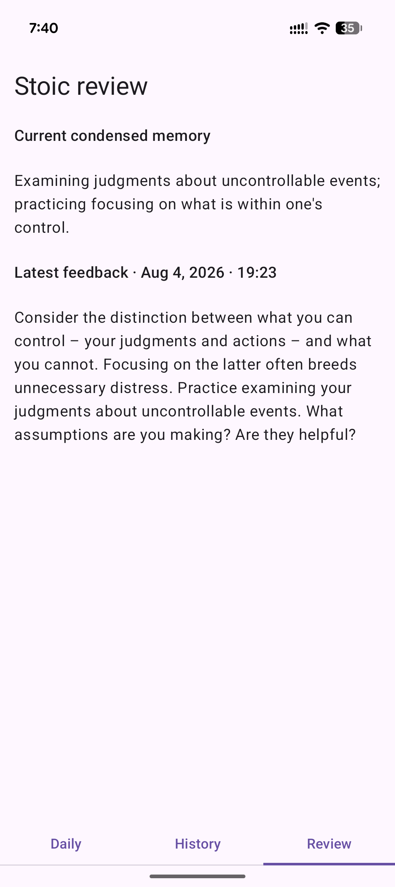

# dear-marcus

Daily Stoic journaling with optional on-device reflection: your entries, your data, your device.

 

## Local by design

- Journal entries and approved derived insights are stored in the app's private local storage. The release policy prohibits accounts, cloud sync, telemetry, Firebase, and journal network access. The source manifest requests no `INTERNET` permission; a release is eligible only after its resolved dependency graph and merged manifest meet that policy.
- Android Auto Backup and data extraction are disabled for app data. The app does not store prompt transcripts or unvalidated model responses.
- Your three answers are saved before optional reflection is attempted. Saving, reading, editing, deleting, clearing, and exporting entries do not require Gemini Nano.

## Optional Gemini Nano reflection

Dear Marcus uses the ML Kit Prompt API, which is Beta, with Gemini Nano on the device. Android API 26 is the app minimum, not a promise that Nano is available: availability depends on the device, its system AI service, and model state at runtime.

- When a compatible device reports that the on-device model is downloadable, you must explicitly start its download. There is no automatic download or cloud fallback.
- Reflection runs only after a user action while the app is in the foreground. It does not run in the background or retry automatically.
- If Nano is unavailable, downloading, busy, blocked, or produces unusable output, the journal entry remains saved and the app clearly reports that feedback is unavailable or needs a later manual retry.

## Daily reminders

- Optional daily reminders are scheduled locally with Android's inexact, best-effort alarms. Delivery can be delayed by device and Android power-management conditions; it is not guaranteed at an exact time.
- Notifications require Android notification permission where applicable. If permission is denied or notifications are blocked, no reminder notification is shown. The app does not request exact-alarm permission.

## Delete, clear, and backup

- Deleting an entry removes its local raw entry and associated derived insight. Editing or deleting an older entry makes later derived insights stale rather than presenting them as current.
- Clear all data removes the local journal, derived insights, and app-owned cache/preferences; it is a destructive action with confirmation.
- Export creates a user-initiated, versioned UTF-8 JSON local backup through Android's system document picker. Import reads a user-selected JSON backup through the system picker. Dear Marcus does not upload backups, choose their destination, or write them automatically; protect an exported file according to its destination's privacy controls.
- Backup import is append-only: when an imported entry ID already exists locally, the local entry and its attached reflection win and the backup copy is skipped. Only a valid, contiguous reflection history is restored, so accepted feedback can restore the current memory while stale or invalid reflections cannot.
- Legacy Markdown exports and imports are not supported.
